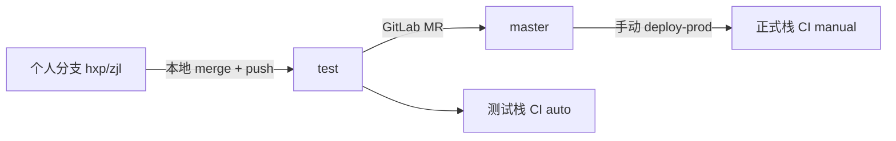

# Git 分支与部署协作规范

本文约定本仓库的分支用途、日常开发与测试/正式发布流程。**分支命名**：每人固定一个**拼音缩写小写**个人分支（如 `hxp`、`zjl`）。下文以 `hxp` 为例，请替换为你的分支名。

完整 CI 与环境说明见 [DEPLOY.md](./DEPLOY.md)；工程约定见 [DEVELOPMENT.md](./DEVELOPMENT.md)。

---

## 分支角色

| 分支 | 用途 | 谁可以改 | 推送后 CI |
|------|------|----------|-----------|
| **个人分支**（如 `hxp`） | 日常开发与提交 | 分支所有者 | 无自动部署 |
| **`test`** | 测试环境集成线 | **禁止**直接改；仅本地 **merge** 个人分支后 push | 自动 `deploy-test` |
| **`master`** | 正式环境发布线 | **禁止**本地直接改；仅 **GitLab MR 合并** | 流水线中**手动** `deploy-prod` |



---

## 1. 开发修改必须使用个人分支

**规则**：所有业务代码与配置的 commit，必须在**自己的拼音缩写分支**上完成；**禁止**在 `test`、`master` 上直接修改并提交。

**首次创建个人分支**（从最新 `test` 拉出）：

```bash
git fetch origin
git switch -c hxp origin/test    # 将 hxp 换成你的拼音缩写
git push -u origin hxp           # 首次推送到远程个人分支（可选但推荐）
```

**检查当前分支**：

```bash
git branch --show-current
```

---

## 2. `test` 分支只能走合并，禁止直接修改

**禁止**在 `test` 上直接改文件、commit、push：

```bash
# 错误示例 — 不要这样做
git switch test
# ... 直接改代码 ...
git commit -m "fix something"
git push origin test
```

**允许**：在本地 checkout `test` 后，仅用于 **merge 个人分支** 并 push（见第 3 节）。

可选加强：在 GitLab 将 `test` 设为 Protected branch，限制仅 Maintainer 可 push，或通过 MR 合入 `test`。

---

## 3. 部署测试环境：本地合并到 `test`，解决冲突后推送

测试栈部署由 **`git push origin test`** 触发，自动执行 `deploy-test`（见 [DEPLOY.md](./DEPLOY.md)）。

**标准流程**（须本地 merge，**禁止** `git push origin hxp:test` 跳过本地 `test` 合并）：

```bash
git fetch origin

# 1) 个人分支先与 test 对齐，并完成开发提交
git switch hxp
git merge origin/test
# ... 开发、自测 ...
git add .
git commit -m "feat: 你的改动说明"

# 2) 本地合并到 test
git switch test
git pull origin test
git merge hxp
# 若有冲突：改文件 → git add . → git commit（完成 merge commit）

# 3) 前端静态资源（CI 不跑 Node，须本地预编译）
.\build-public-test.bat
git add public/admin public/feishu
git commit -m "build: public test assets"    # 仅当 bat 产生变更时需要

# 4) 推送 test，触发 CI
git push origin test

# 5) 回到个人分支，与 test 保持一致
git switch hxp
git merge origin/test
git push origin hxp
```

**禁止/弃用**（跳过本地 `test` 合并）：

```bash
git push origin hxp:test    # 不要这样部署测试环境
```

---

## 4. 修改前先更新 `test`，完成后推送到个人远程分支

**每次开始改代码前**：

```bash
git fetch origin
git switch hxp
git merge origin/test        # 先同步 test，再改
```

**改完并 commit 后**（推送到**个人远程分支**，不要推到 `test`/`master`）：

```bash
git push -u origin hxp         # 首次
git push origin hxp            # 之后
```

查看个人分支相对 `test` 的未合并提交：

```bash
git log --oneline origin/test..hxp
```

---

## 5. 正式环境：仅 GitLab MR + 手动 CI

**规则**：

- **禁止**本地 `git switch master` 后直接改代码、commit、`git push origin master`。
- 正式发布必须在 **GitLab 网页**创建 Merge Request，合并进 `master` 后，在流水线中**手动**运行 `deploy-prod`。

**推荐步骤**：

1. 在测试环境验收通过（`test` 已部署且功能 OK）。
2. 仓根执行正式静态构建并提交（可合并在 `test` 上完成后再 MR）：

   ```bash
   .\build-public-prod.bat
   git add public/admin public/feishu
   git commit -m "build: public prod assets"
   ```

3. 打开 GitLab → **Merge requests** → **New merge request**。
4. 源分支选 **`test`**，目标分支选 **`master`**（或经 Review 的、已测过的源分支 → `master`）。
5. 填写说明、指定 Reviewer，合并 MR。
6. 进入 **`master`** 分支最新 **Pipeline** → 找到 **`deploy-prod`** 任务 → 点击 **Run / 运行**（手动 job）。
7. 在正式域验收（见 [DEPLOY.md](./DEPLOY.md) 验收 curl）。

---

## 6. 临时分支尽量不要推送到远程

- 本地临时排查可用：`git switch -c wip/debug-xxx`（**不要** `git push`）。
- 用完删除：

  ```bash
  git switch hxp
  git branch -D wip/debug-xxx
  ```

- 每人长期只维护**一个**远程个人分支（如 `origin/hxp`）；避免多个 `feature/*` 长期挂在远程。

---

## 附录：常用命令与补救

| 场景 | 命令 |
|------|------|
| 查看状态 | `git status` |
| 误在 `test` 上改了未提交 | `git stash` → `git switch hxp` → `git stash pop` → 在 `hxp` 提交 |
| 远程 `test` 为准，重置本地个人分支 | `git fetch origin && git switch hxp && git reset --hard origin/test` |
| 远程 `test` 覆盖远程 `hxp`（慎用） | `git push origin origin/test:hxp --force-with-lease` |
| 个人分支覆盖远程 `test`（**禁止**，见第 3 节） | ~~`git push origin hxp:test`~~ |

---

## 推荐全流程（一览）

```text
个人分支开发 → 本地 merge 到 test → push test（自动测栈）
→ 验收 → build-public-prod → GitLab MR test→master → 合并 → 手动 deploy-prod
```
