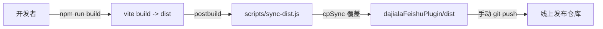

# 项目说明（Overview）

精简版的项目重点与关键细节，便于新成员快速接手。

## 项目定位

飞书多维表格（Base）扩展。运行在飞书多维表格的扩展宿主中，通过 `@lark-base-open/js-sdk` 与当前表格交互。

- 入口：[src/main.js](../src/main.js) 将 Vue 应用挂载到 `#app`。
- 根组件：[src/App.vue](../src/App.vue)，仅渲染主表单 [src/components/Form.vue](../src/components/Form.vue)。

## 技术栈

- Vue 3 + Vite
- Element Plus（按需引入，见 [vite.config.js](../vite.config.js) 的 `unplugin-vue-components` + `ElementPlusResolver`）
- vue-i18n（语言通过 `bitable.bridge.getLanguage()` 动态切换，见 [src/locales/i18n.js](../src/locales/i18n.js)，资源文件 `en.json` / `zh.json` / `ja.json`）
- axios（统一封装于 [src/utils/request.js](../src/utils/request.js)，含重试）

## 主结构

- 主表单：[src/components/Form.vue](../src/components/Form.vue)
  - 按平台切分子表单：
    - 公众号 [src/components/ghForm.vue](../src/components/ghForm.vue)
    - 抖音 [src/components/dyForm.vue](../src/components/dyForm.vue)
    - 视频号 [src/components/v2Form.vue](../src/components/v2Form.vue)
    - 快手 [src/components/ksForm.vue](../src/components/ksForm.vue)
    - 小红书 [src/components/xhsForm.vue](../src/components/xhsForm.vue)（当前在 `Form.vue` 中被注释禁用）
- 登录：[src/components/LoginDialog.vue](../src/components/LoginDialog.vue)、[src/components/WechatLoginDialog.vue](../src/components/WechatLoginDialog.vue)
- 充值：[src/components/RechargeDialog.vue](../src/components/RechargeDialog.vue)
- 多维表交互：[src/components/TableSelect.vue](../src/components/TableSelect.vue)、[src/utils/tableHelper.js](../src/utils/tableHelper.js)
- 主题跟随 Base：[src/utils/theme.js](../src/utils/theme.js)
- 敏感信息展示：[src/components/sensitiveText.vue](../src/components/sensitiveText.vue)

## 后端接口

- 统一通过 [src/utils/request.js](../src/utils/request.js) 访问，`baseURL: https://www.dajiala.com`，超时 10s。
- 内置 `withRetry`：当响应 `code !== 0` 或请求异常时，最多重试 3 次、间隔 1s；失败兜底返回 `{ code: -1, msg: '网络连接错误' }`。
- 业务中也有直接用 `axios` 调用 `https://www.dajiala.com/fbmain/...` 的端点，例如：
  - 二维码与登录：`/fbmain/account/v1/qrcode`、`/fbmain/account/v1/login`
  - 用户详情：`/fbmain/monitor/v3/api_user_detail`
  - 订单：`/fbmain/account/v1/api_create_order`、`/fbmain/account/v1/api_check_order_status`、`/fbmain/account/v1/api_pay_info`

## 关键约定

- [vite.config.js](../vite.config.js) 设置 `base: './'`，产物按相对路径加载，适配扩展宿主托管。
- 飞书 App ID 硬编码在 [src/components/Form.vue](../src/components/Form.vue) 的 `app_id = 'cli_a9f6a88460f85bc6'`，涉及飞书账号授权登录。
- i18n 默认 `locale: 'zh'`，挂载后会根据宿主语言覆盖。

## 目录速览

```text
src/
  App.vue              根组件
  main.js              入口
  assets/              样式与静态资源
  components/          业务组件（Form 与各平台子 Form、登录、充值、字段选择等）
  locales/             i18n 资源（en/zh/ja）与配置
  utils/               request / theme / tableHelper
scripts/
  sync-dist.js         构建后把 dist 同步到 dajialaFeishuPlugin/dist
docs/
  OVERVIEW.md          本文件
dajialaFeishuPlugin/   发布载体目录（独立仓库，已在 .gitignore 中忽略）
```

## 开发 / 构建 / 发布

- 本地开发：`npm run dev`
- 构建并同步产物：`npm run build`
  - 构建成功后，`postbuild` 钩子会自动执行 [scripts/sync-dist.js](../scripts/sync-dist.js)，删除并重建 `dajialaFeishuPlugin/dist`，将最新 `dist/` 覆盖过去。
- 上线：进入 `dajialaFeishuPlugin/`（独立的 Git 仓库），`git add/commit/push` 其中的 `dist`，即完成线上更新。
- 根目录 [README.md](../README.md) 里提到的「飞书共享表单」是早期/正式上架时使用的流程，**日常迭代更新走上面的 `dajialaFeishuPlugin` 路径**。

### 发布流程示意



## 注意事项

- 同步脚本仅做本地覆盖，不会自动 `git commit/push`，避免误发布。
- [scripts/sync-dist.js](../scripts/sync-dist.js) 使用 Node 内置 `fs.cpSync`，要求 Node ≥ 16.7；低版本环境可改用 `fs-extra`。
- 若要求更高自动化，可另写 `scripts/publish-dajiala.js` 在同步后执行 `git -C dajialaFeishuPlugin ...`，但默认保持人工确认。
